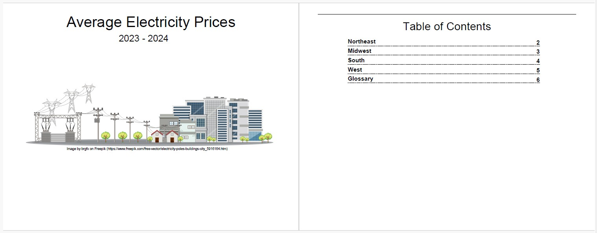
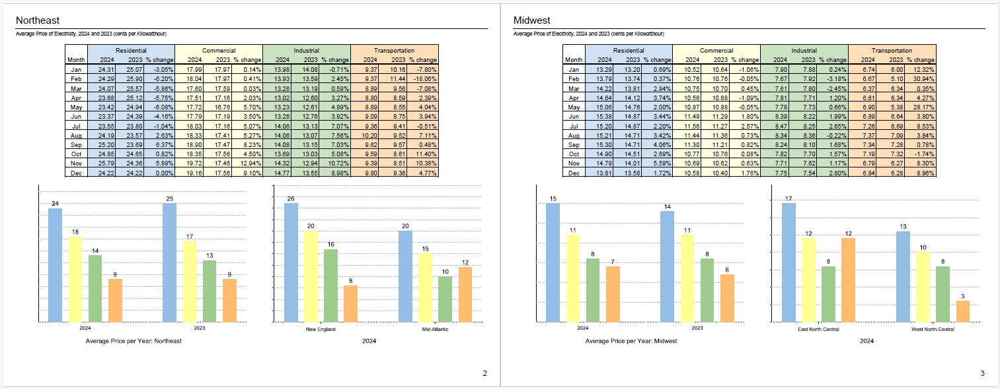
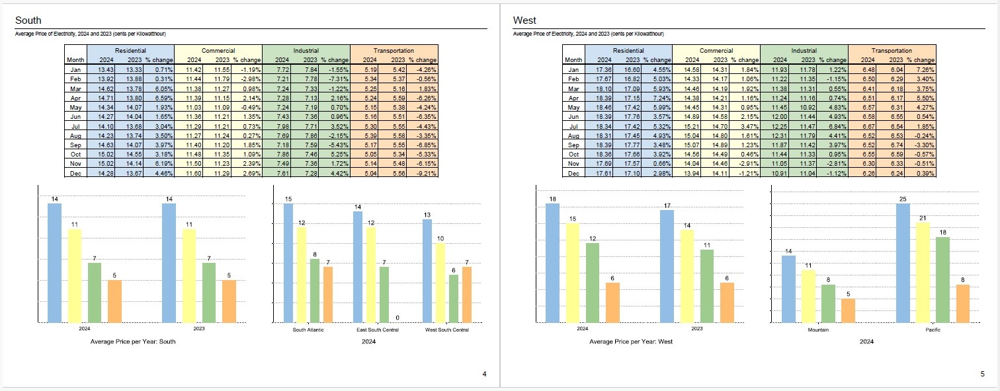
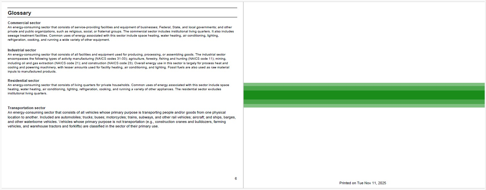

# Jaspersoft

I have experience designing and developing reports, report books, HTML5 charts, and interactive dashboards using Jaspersoft. In this repository, I’m working with the Community Edition of Jaspersoft Studio.

## :file_folder: Repository Content

- `MyReports/` - Jasper source files
- `images/` - images used in README.md
- README.md - Documentation (this file)

## :page_facing_up: Flight Report

  [Image by juicy_fish on Freepik](https://www.freepik.com/free-vector/airplane-with-circle-flight-path_148768013.htm)

- [Dataset used](https://github.com/Im-TARO/Flights/tree/main/cleaned_data)
- `Source jrxml files` - MyReports/Flights
- `Report output` - MyReports/Flights/Report Output/Airlines.pdf

## :book: Book of Reports

- Dataset: [EIA.gov - EIA-861M Monthly Electric Power Industry Report](https://www.eia.gov/electricity/data/state/xls/861m/HS861M%202010-.xlsx)
  - csv file loaded into tmp table
  - cleaned data and inserted into table
- `Source jrxml files` - MyReports/Dept of Energy
- `Report output` - MyReports/Dept of Energy/Report Output/AverageElectricityPrices.pdf

