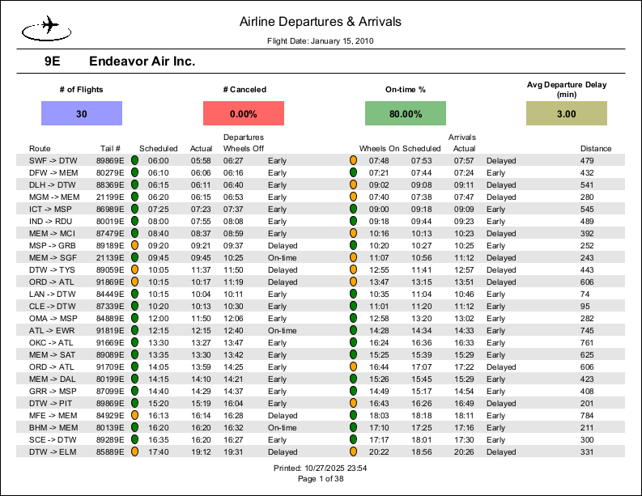

# Jaspersoft

I have experience building reports, report books, and dashboards with Jaspersoft.

## :file_folder: Repository Content

- `MyReports/` - Jasper source files
- `images/` - images used in README.md
- README.md - Documentation (this file)

## :page_facing_up: Flight Report

  [Image by juicy_fish on Freepik](https://www.freepik.com/free-vector/airplane-with-circle-flight-path_148768013.htm)

- [Dataset used](https://github.com/Im-TARO/Flights/tree/main/cleaned_data)
- `Source jrxml files` - MyReports/Flights
- `Report output` - MyReports/Flights/Report Output/Airlines.pdf

<!--
## :book: Book of Reports

## :chart: Dashboards
-->